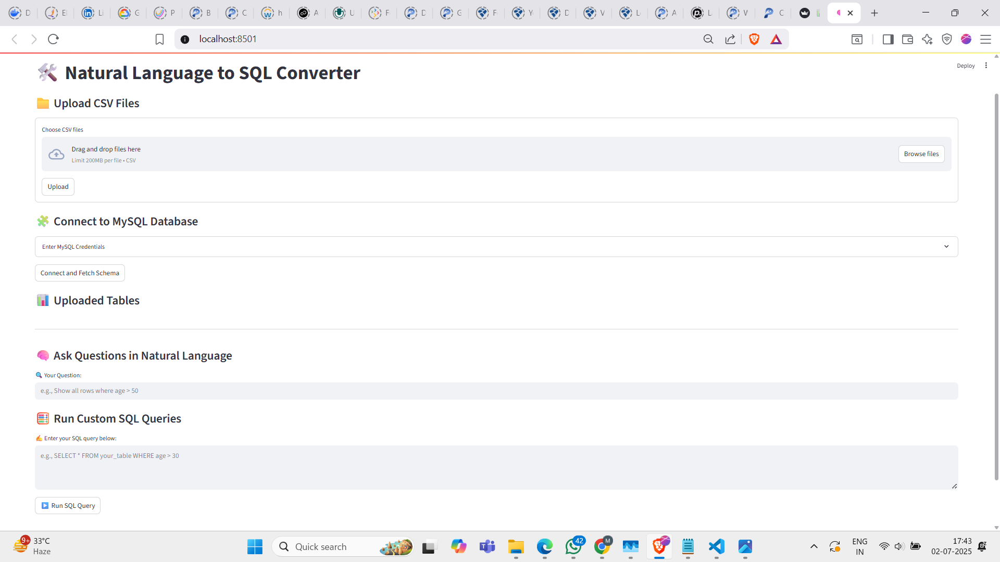
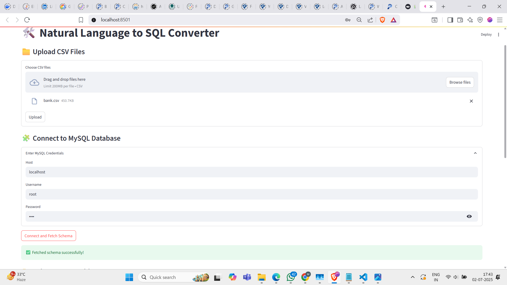
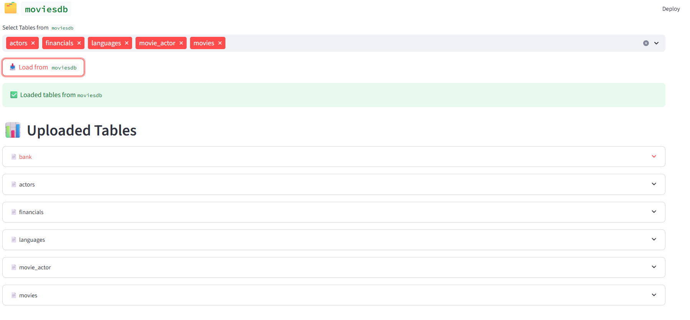
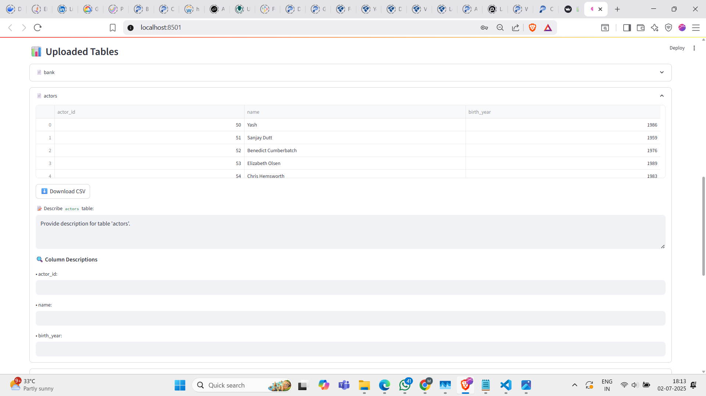
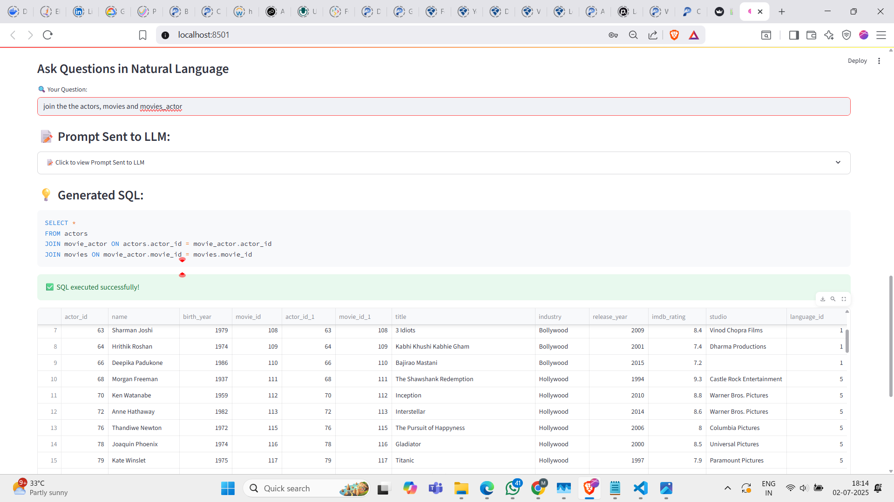

# 💬 Natural Language to SQL Converter with Multi-Source Support

This Streamlit-based application allows users to query data from various sources (like **MySQL** or **CSV files**) using plain natural language. The queries are converted into SQL using **OpenAI's ChatGPT LLM** under the hood.

---

## 🚀 Features

- 🔌 **MySQL Database Integration**: Connect to a MySQL database and automatically extract schema.
- 📂 **CSV File Upload**: Upload multiple CSV files and query them using natural language.
- 🧠 **Table & Attribute-Level Prompting**: Provide metadata or context at table and column levels to improve query accuracy.
- 🤖 **LLM-Powered SQL Generation**: Convert your natural language queries into SQL using OpenAI’s GPT.
- ✍️ **Manual Query Support**: You can write and execute your own SQL queries.
- 📊 **Visual Interface**: Clean and interactive UI built with Streamlit.

---

## 🖼️ Screenshots

### 🧭 1. Application Overview
<p align="center">
  
</p>

---

### 🔐 2. MySQL Connection
> Provide your MySQL credentials and database details to connect.
<p align="center">
  
</p>

---

### 📋 3. Table Upload
> Upload multiple CSV files and view available tables.
<p align="center">
  
</p>

---

### 🧾 4. Table and Attribute-Level Prompting
> Add detailed descriptions to tables and attributes to help the model understand your schema.
<p align="center">
  
</p>

---

### 🔎 5. Querying Across Multiple Files
> Ask questions and get answers across multiple data sources.
<p align="center">
  
</p>

---

## 🛠️ How It Works

1. Connect to a **MySQL** database or upload **CSV files**.
2. Schema is extracted and optionally enhanced with user prompts.
3. Ask a natural language question (e.g., *"What is the average salary by department?"*).
4. The model generates and executes the SQL.
5. Results are displayed in an interactive format.
6. You can also write and run your own SQL queries.

---

## ⚙️ Setup Instructions

1. **Clone the Repository**
   ```bash
   git clone https://github.com/your-username/Text_to_sql.git
   cd Text_to_sql
